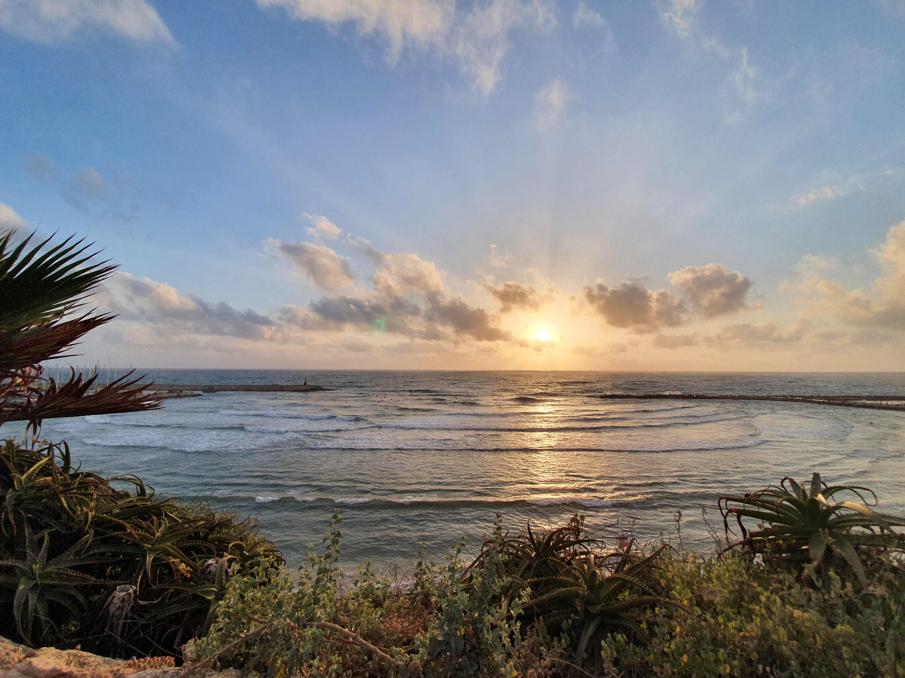
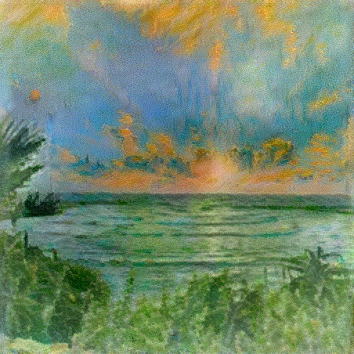
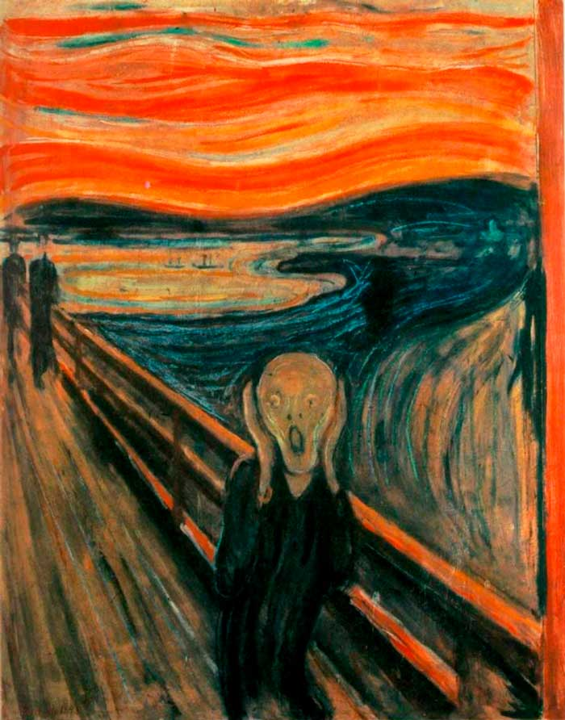
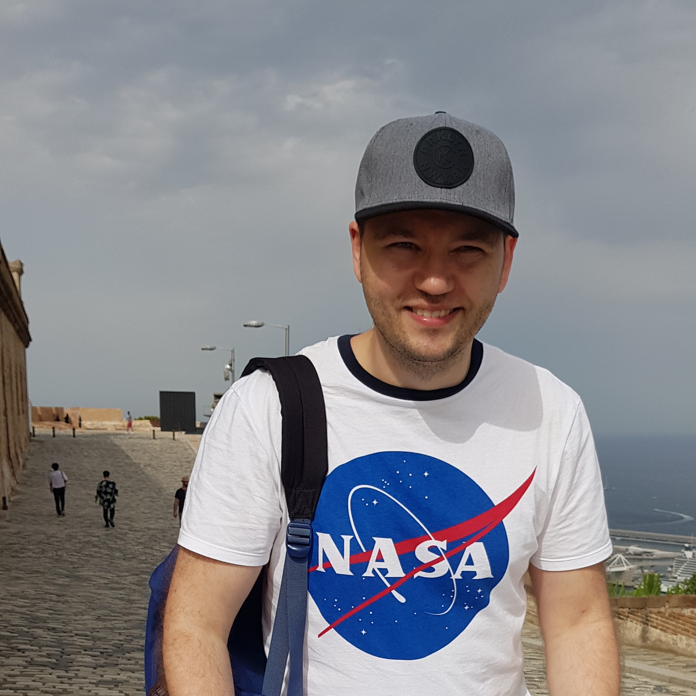
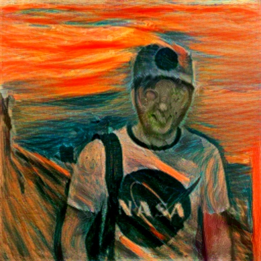

# Style Transfer by Relaxed Optimal Transport and Self-Similarity

This is Pytorch implementation of the paper https://arxiv.org/abs/1904.12785
### How to use
```
git clone git@github.com:bekkermans/style_transfer.git
pip install -r requirements.txt
python main.py {CONTENT IMAGE PATH} {STYLE IMAGE PATH}
```
### Examples
   <br>
 
  

### Reference
```
  @misc{STROTSS,
    author = {Nicholas Kolkin, Jason Salavon, Greg Shakhnarovich},
    title = {Style Transfer by Relaxed Optimal Transport and Self-Similarity},
    year = {2019},
    howpublished = {\url{https://arxiv.org/abs/1904.12785}},
  }
```
